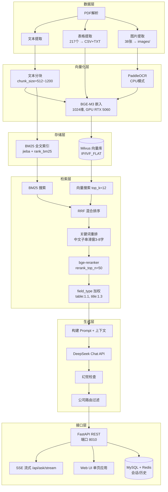
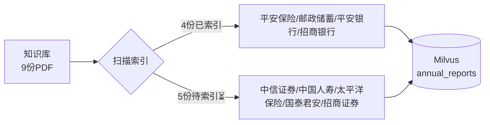

# 🧠 RAG 项目架构总览

---

## 📁 项目一：招股书 RAG
> **路径：** `/mnt/e/10--agent--任务/任务 1/`  
> **文档：** 2份招股书（兴图新科 + 力源信息）共 350 页

### 📐 核心模块文件

| 层级 | 文件 | 职责 |
|------|------|------|
| 数据层 | `pdf_processor.py` | PyMuPDF 解析、表格检测、图片过滤 |
| 向量化层 | `embedding_provider.py` | BGE-M3 加载/嵌入、显存管理 |
| 存储层 | `vector_store.py` | Milvus 操作、BM25 构建、RRF 检索 |
| 检索层 | `retrieval_strategy.py` | 关键词重排、reranker、查询改写 |
| 生成层 | `rag_engine.py` | Prompt 构建、流式生成、幻觉检测 |
| LLM 抽象 | `llm_provider.py` | DeepSeek/OpenAI 策略模式 |
| 接口层 | `api/api.py` | FastAPI + SSE + Web UI |
| 配置 | `config.py` | 统一配置管理 |

---

## 📁 项目二：年报问答（工单 7）
> **路径：** `/mnt/e/10--agent--任务/工单7_年报问答/`  
> **文档：** 9份年报（2019-2021，银行/保险/证券）

| 状态 | 数量 | 说明 |
|:----:|:----:|------|
| ✅ 已索引 | 4/9 | 2019年平安保险、邮政储蓄、平安银行、招商银行 |
| ⏳ 进行中 | 5/9 | `--scan` 增量模式运行中 |

---

## 📋 待完成 / 规划中

| 优先级 | 任务 | 状态 | 预计工时 |
|:------:|------|:----:|:--------:|
| 🔴 高 | **补索引** — 表格→Milvus + 图片OCR→Milvus | 📝 脚本已就绪，索引跑完后执行 | 30分钟 |
| 🟡 中 | **LightRAG** — 含表格数据后重建知识图谱 | ⚠️ 首次构建已完成（需重build） | 1小时 |
| 🟡 中 | **RAGAS 评估** — 量化检索+生成质量 | ❌ 未执行 | 30分钟 |
| 🟢 低 | **Embedding 微调** — bge-base-zh-v1.5 微调 | 📋 规划中，需租卡 | 4~6小时 |

### 🔧 已知问题 & 踩坑记录

| 问题 | 修复 |
|------|------|
| GPU 渐进式变慢（显存泄漏） | `torch.cuda.empty_cache()` 每 batch 后调用 |
| batch_size 配置不生效 | `main.py` 的 `VectorStore()` 未传 `batch_size=config.embedding_batch_size` |
| 中文关键词重排失效 | 子串滑动窗口（3-8字）替代词级匹配 |
| LightRAG 新版本异步 API | `rag.ainsert()` + `asyncio.run()` + `initialize_storages()` |
| 表格/图片未被检索 | 补充 `supplement_index.py` 写入 Milvus（field_type=table/image） |
