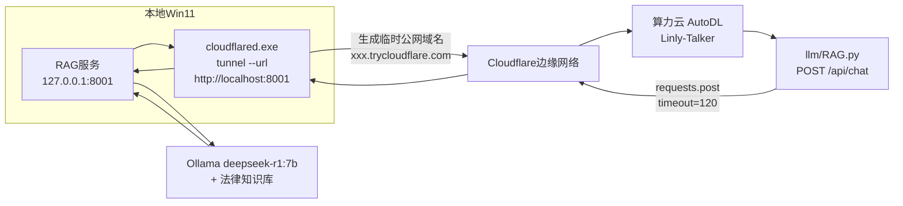

下面这份 Markdown 文档把这次从本地 RAG 到算力云数字人的完整打通过程沉淀下来，包含快速启动清单、踩坑记录表、关键文件清单和长期稳定性建议。
---
## 文档目的
把"本地 Win11 RAG 服务（127.0.0.1:8001）↔ Cloudflare Tunnel ↔ AutoDL 算力云 Linly-Talker 数字人"这条链路的完整搭建、踩坑与修复过程固化成可复用文档，下次开机 5 分钟即可跑通。
## 完整链路一图看懂

链路核心：**Cloudflare Tunnel 把本地 8001 端口暴露成一个 https 公网域名，算力云上的 RAG.py 通过这个域名反查本地 RAG 服务**。免费隧道每次重启地址都会变，这是后续所有"地址更新"操作的根因。
---
## 今日快速启动清单（每天开机照此执行，约 5 分钟）
### 第 1 步：本地启动 RAG 服务（1 分钟）
```powershell
# 进入 RAG 项目目录
cd E:\rag后续工单   # 换成你的实际路径
# 启动服务
python main.py       # 换成你的启动文件
```
验证：浏览器打开 `http://127.0.0.1:8001` 能看到页面即正常。
### 第 2 步：本地启动 Cloudflare 隧道（1 分钟，拿新地址）
```powershell
# 另开一个 PowerShell 窗口
cd "D:\Cloudflare Tunnel（穿透）"
.\cloudflared-windows-amd64.exe tunnel --url http://localhost:8001
```
等几秒，看到 `https://xxx-xxx-xxx.trycloudflare.com` 后**复制新地址**，这个窗口不能关。
### 第 3 步：算力云更新地址 + 启动 WebUI（2 分钟）
SSH 登录 AutoDL，把 `webui.py` 第 831 行的旧域名换成今天的新域名：
```bash
python3 << 'EOF'
with open('/root/Linly-Talker/webui.py', 'r') as f:
    content = f.read()
old_domain = "https://lanes-abc-seminars-map.trycloudflare.com"  # 昨天的旧地址
new_domain = "https://今天的新地址.trycloudflare.com"            # 换成今天的
content = content.replace(old_domain, new_domain)
with open('/root/Linly-Talker/webui.py', 'w') as f:
    f.write(content)
print("域名已更新")
EOF
```
然后杀掉旧进程并启动：
```bash
cd ~/Linly-Talker
pkill -f webui.py; sleep 2
python webui.py
```
### 第 4 步：WebUI 里验证
打开数字人 WebUI → LLM 模型选择 `RAG` → 发一条法律问题 → 等待数字人回答（RAG + Ollama 较慢，耐心等 30-120 秒）。
---
## 踩坑记录表（按时间顺序，逐行可查）
| 阶段 | 操作 | 错误现象 | 根本原因 | 解决方案 |
|------|------|----------|----------|----------|
| 隧道建立 | `cloudflared tunnel --url` | 一直等待无输出 | 需要几秒初始化 | 等到出现 `Your quick Tunnel has been created` 才算成功 |
| 算力云测试 | 把 Python 代码粘贴进 bash | `bash: import: command not found`、`syntax error near unexpected token` | bash 终端不能直接跑 Python 代码 | 先输入 `python3` 进入 `>>>` 提示符，再粘贴代码 |
| 算力云测试 | `requests.post` 超时 | `ReadTimeout: Read timed out (read timeout=30)` | Ollama 首次加载模型慢 + 30s 超时太短 | `timeout=120`；同时确认本地 Ollama 正常 |
| 本地 Ollama | `ollama run` | `CUDA error`、`llama runner process has terminated` | 显存不足或模型未加载完 | 先 `ollama list` 确认模型，单独 `ollama run deepseek-r1:7b "测试"` 验证能跑通再接 RAG |
| 本地 RAG | 返回 `模型调用失败: Ollama call failed with status code 500` | RAG 接口通了但 Ollama 崩 | Ollama 进程异常 | 重启 Ollama 服务，确保 `ollama serve` 只有一个实例 |
| 代码接入 | `from LLM import LLM` 报 `ModuleNotFoundError` | 在 `~` 目录执行 | 不在项目根目录 | `cd ~/Linly-Talker` 后再执行 |
| `__init__.py` 改动 | `python webui.py` 报 `IndentationError: expected an indented block` | 手动改文件缩进错乱 | 用 heredoc 整体覆盖 | 用 `cat > ... << 'EOF' ... EOF` 整体重写文件（见下方"关键文件清单"） |
| `webui.py` 改动 | WebUI 下拉列表没有 RAG 选项 | 只改了 `__init__.py`，没改 `webui.py` 的 `gr.Dropdown` | 下拉列表是硬编码的 | 改 `webui.py` 两处：①第 461 行 choices 列表加 `'RAG'`；②第 830 行加 `elif model_name == 'RAG'` 分支 |
| sed 命令 | `sed -i "s/.../.../"` 报 `bash: !'/'QAnything',: event not found` | 替换串里有 `!` | bash 把 `!` 当历史扩展 | 改用 `python3 << 'EOF'` 做文件替换，避开 bash 的 `!` |
| WebUI 启动 | `OSError: Cannot find empty port in range: 6006-6006` | 上次进程没退出 | 端口被占用 | `pkill -f webui.py && sleep 2 && python webui.py` |
| 端口排查 | `lsof -ti:6006` 报 `lsof: command not found` | AutoDL 容器精简 | 没装 lsof/fuser | 用 `pkill -f webui.py` 或 `ss -tulnp \| grep 6006` 替代 |
| WebUI 运行 | 选 RAG 后报 `llm_path is not defined` | `webui.py` 的 `llm_model_change` 函数里直接用了未定义变量 | 该函数参数里没有 `llm_path` | 把地址硬编码进 `model_path='https://xxx.trycloudflare.com'`（见下方改动点） |
| 隧道地址 | 第二天重启后 WebUI 调 RAG 失败 | 昨天的 `trycloudflare.com` 地址失效 | 免费隧道每次重启域名都变 | 每天启动隧道后更新 `webui.py` 里的域名（见"快速启动清单"第 3 步） |
---
## 关键文件清单（可直接复制）
### 1. `llm/RAG.py`（新建，完整可复制版）
```python
# -*- coding: utf-8 -*-
import requests
import logging
logger = logging.getLogger(__name__)
class RAG:
    """通过 HTTP 调用本地 RAG 服务的 LLM 适配器"""
    def __init__(self, base_url="http://127.0.0.1:8001", timeout=120,
                 user_id=1, username="digital_human", role="lawyer"):
        self.base_url = base_url.rstrip("/")
        self.timeout = timeout
        self.user_id = user_id
        self.username = username
        self.role = role
        self.prefix_prompt = ""
        self.conversation_id = None
        self._check_health()
    def _check_health(self):
        try:
            r = requests.get(f"{self.base_url}/health", timeout=5)
            if r.status_code == 200:
                logger.info(f"RAG服务连接正常: {self.base_url}")
        except Exception:
            logger.warning("RAG服务暂时无法连接，请确认隧道与服务已启动")
    def generate(self, question, system_prompt=""):
        try:
            resp = requests.post(
                f"{self.base_url}/api/chat",
                json={
                    "user_id": self.user_id,
                    "username": self.username,
                    "message": question,
                    "role": self.role,
                    "conversation_id": self.conversation_id
                },
                timeout=self.timeout
            )
            resp.raise_for_status()
            data = resp.json()
            self.conversation_id = data.get("conversation_id") or self.conversation_id
            answer = data.get("answer", "")
            sources = data.get("sources", [])
            if sources:
                files = "、".join(s.get("file", "") for s in sources if s.get("file"))
                if files:
                    answer += f"\n\n来源：{files}"
            return answer
        except requests.exceptions.ConnectionError:
            return "RAG服务连接失败，请检查 Cloudflare Tunnel 是否正在运行"
        except requests.exceptions.Timeout:
            return "RAG服务响应超时，请确认本地 Ollama 是否正常"
        except Exception as e:
            return f"RAG查询出错: {e}"
    def chat(self, system_prompt, message, history):
        response = self.generate(message, system_prompt)
        history.append((message, response))
        return response, history
```
> 注意：`role` 默认 `lawyer`（你的法律方向），接口路径 `/api/chat`，请求体字段 `user_id/username/message/role/conversation_id`，返回取 `answer` —— 这几处必须和你本地 RAG 的 `model.py` 定义一致。
### 2. `llm/__init__.py`（改动点，整体覆盖）
用 heredoc 一次性写好，避免缩进错误：
```bash
cat > /root/Linly-Talker/LLM/__init__.py << 'EOF'
# -*- coding: utf-8 -*-
from .Linly import Linly
from .Qwen import Qwen
from .Qwen2 import Qwen2
try:
    from .Gemini import Gemini
except Exception as e:
    print("Gemini模型加载失败，可能是因为没有google-generativeai库，但是Gemini模型不是必须的，可以忽略")
from .ChatGPT import ChatGPT
from .ChatGLM import ChatGLM
from .Llama2Chinese import Llama2Chinese
from .GPT4Free import GPT4FREE
from .QAnything import QAnything
from .RAG import RAG
class LLM:
    def __init__(self, mode='offline'):
        self.mode = mode
    def init_model(self, model_name, model_path='', api_key=None, proxy_url=None,
                   prefix_prompt='请用少于25个字回答以下问题\n\n'):
        valid = ['Linly', 'Qwen', 'Qwen2', 'Gemini', 'ChatGLM', 'ChatGPT',
                 'Llama2Chinese', 'GPT4Free', 'QAnything', 'RAG', '直接回复 Direct Reply']
        if model_name not in valid:
            raise ValueError(f"model_name must be one of {valid}")
        if model_name == 'Linly':
            llm = Linly(self.mode, model_path)
        elif model_name == 'Qwen':
            llm = Qwen(self.mode, model_path)
        elif model_name == 'Qwen2':
            llm = Qwen2(self.mode, model_path)
        elif model_name == 'Gemini':
            llm = Gemini(model_path, api_key, proxy_url)
        elif model_name == 'ChatGLM':
            llm = ChatGLM(self.mode, model_path)
        elif model_name == 'ChatGPT':
            llm = ChatGPT(model_path, api_key, proxy_url)
        elif model_name == 'Llama2Chinese':
            llm = Llama2Chinese(model_path, self.mode)
        elif model_name == 'GPT4Free':
            llm = GPT4FREE()
        elif model_name == 'QAnything':
            llm = QAnything()
        elif model_name == 'RAG':
            rag_url = model_path if model_path else "http://127.0.0.1:8001"
            llm = RAG(base_url=rag_url, role="lawyer")
        elif model_name == '直接回复 Direct Reply':
            llm = self
        llm.prefix_prompt = prefix_prompt
        return llm
    def chat(self, system_prompt, message, history):
        response = self.generate(message, system_prompt)
        history.append((message, response))
        return response, history
    def generate(self, question, system_prompt='system无效'):
        return question
EOF
```
验证：`cd ~/Linly-Talker && python3 -c "from LLM import LLM; print('OK')"`
### 3. `webui.py`（两处改动点，用 Python 脚本改）
**改动点 A：第 461 行下拉列表加 `'RAG'`**
```python
# 验证当前内容
sed -n '461p' ~/Linly-Talker/webui.py
# 应为：llm_method = gr.Dropdown(choices=['Qwen', 'Qwen2', 'Linly', 'Gemini', 'ChatGLM', 'ChatGPT', 'GPT4Free', 'QAnything', '直接回复 Direct Reply', 'Comming Soon!!!'], ...)
```
用 Python 替换（避开 bash 的 `!` 问题）：
```bash
python3 << 'EOF'
with open('/root/Linly-Talker/webui.py', 'r') as f:
    content = f.read()
old = "'QAnything', '直接回复 Direct Reply', 'Comming Soon!!!'"
new = "'QAnything', 'RAG', '直接回复 Direct Reply', 'Comming Soon!!!'"
content = content.replace(old, new)
with open('/root/Linly-Talker/webui.py', 'w') as f:
    f.write(content)
print("改动点A完成")
EOF
```
**改动点 B：第 830 行附近加 RAG 加载分支，地址硬编码**
```bash
python3 << 'EOF'
with open('/root/Linly-Talker/webui.py', 'r') as f:
    content = f.read()
old = """        elif model_name == 'QAnything':
            llm = llm_class.init_model('QAnything')
            gr.Info("QAnything模型接口加载成功")"""
new = old + """
        elif model_name == 'RAG':
            llm = llm_class.init_model('RAG', model_path='https://你的今天地址.trycloudflare.com')
            gr.Info("RAG服务加载成功")"""
content = content.replace(old, new)
with open('/root/Linly-Talker/webui.py', 'w') as f:
    f.write(content)
print("改动点B完成")
EOF
```
验证两处都在：
```bash
grep -n "RAG" ~/Linly-Talker/webui.py
# 应看到 461 行和 830 行附近都有 RAG
```
---
## 长期稳定性建议
**1. 固定 Cloudflare 域名（强烈建议，告别每天改地址）**
免费 quick tunnel 每次重启域名都变。如果你有自己的域名托管在 Cloudflare，配置命名隧道后域名固定：
```bash
# 本地登录（只需一次）
cloudflared tunnel login
# 创建命名隧道
cloudflared tunnel create rag-tunnel
# 配置 ~/.cloudflared/config.yml
cat > ~/.cloudflared/config.yml << 'EOF'
tunnel: rag-tunnel
credentials-file: ~/.cloudflared/<隧道ID>.json
ingress:
  - hostname: rag.你的域名.com
    service: http://localhost:8001
  - service: http_status:404
EOF
# DNS 自动配置
cloudflared tunnel route dns rag-tunnel rag.你的域名.com
# 启动（域名固定）
cloudflared tunnel run rag-tunnel
```
之后 `webui.py` 里写死 `https://rag.你的域名.com`，再也不用每天改。
**2. 超时与重试配置**
本地 RAG + Ollama 首次响应慢，`RAG.py` 里 `timeout=120` 是底线。如要更稳，加一次重试：
```python
from requests.adapters import HTTPAdapter
from urllib3.util.retry import Retry
session = requests.Session()
retry = Retry(total=2, backoff_factor=1, status_forcelist=[500,502,503,504])
session.mount("https://", HTTPAdapter(max_retries=retry))
# 之后用 session.post(...) 代替 requests.post(...)
```
**3. 隧道自动重连（Windows 开机自启）**
用 `nssm` 把 cloudflared 注册成 Windows 服务，开机自启、断线自动拉起：
```powershell
# 安装 nssm 后
nssm install cloudflared "D:\Cloudflare Tunnel（穿透）\cloudflared-windows-amd64.exe"
nssm set cloudflared AppParameters "tunnel --url http://localhost:8001"
nssm start cloudflared
```
**4. 避免端口占用循环**
AutoDL 容器没有 lsof/fuser，记住这条命令组合：
```bash
# 查占用
ss -tulnp | grep 6006
# 杀进程
pkill -f webui.py
# 或按 PID
kill -9 <PID>
```
**5. 本地 Ollama 稳定性**
`ollama serve` 只能跑一个实例，重复启动会报 `bind: Only one usage of each socket address`。开机后用 `ollama ps` 确认模型常驻，避免每次冷启动等 30 秒以上。
---
## 附：本地 RAG 接口字段速查（接入前先核对）
| 项目 | 你的实际值 | 说明 |
|------|-----------|------|
| 服务地址 | `http://127.0.0.1:8001` | 本地端口 |
| 对话接口路径 | `/api/chat` | 不是 `/query` |
| 请求体字段 | `user_id, username, message, role, conversation_id` | `role` 用 `lawyer` |
| 返回取值字段 | `answer, sources, conversation_id` | `sources` 是列表 |
| 健康检查 | `/health` | 返回 `{"status":"healthy"}` |
如果以后 RAG 接口字段变了，只需改 `RAG.py` 里的 `json={...}` 和 `data.get(...)` 两处，`__init__.py` 和 `webui.py` 不用动。
